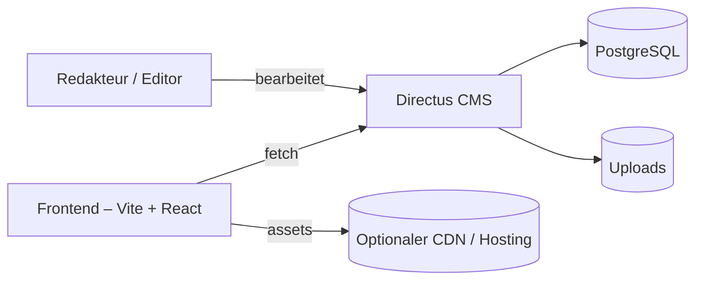

<!-- Banner & Badges -->
<p align="center">
	
	
	
	
	
</p>

# asv-loxstedt

Kompakte, wartbare Codebasis für die Website des ASV Loxstedt — CMS-first mit Directus und einem modernen React + TypeScript Frontend (Vite).

## Inhaltsverzeichnis

- [Überblick](#überblick)
- [Visual Proof](#visual-proof)
- [Hauptmerkmale](#hauptmerkmale)
- [Schnellstart (Entwicklung)](#schnellstart-entwicklung)
- [Ordnerstruktur](#ordnerstruktur)
- [Deployment & Produktion](#deployment--produktion)
- [Contributing](#contributing)
- [Lizenz](#lizenz)

## Überblick

Dieses Repository enthält eine Directus-Instanz (CMS) im Ordner `cms/` sowie eine Vite-React-Frontend-Anwendung im Ordner `frontend/`. Ziel ist eine klare Trennung von Content-Management (Directus) und Präsentation (Frontend), damit Redakteure Inhalte ohne Entwickleraufwand pflegen können.

## Visual Proof

Architekturübersicht (Mermaid):



- Screenshot / Live Preview: Falls gewünscht, füge einen Screenshot in `docs/screenshot.png` ein und verlinke ihn hier.

## Hauptmerkmale

- CMS-first: Inhalte werden in Directus gepflegt.
- Frontend: React + TypeScript, gebaut mit Vite für schnelle Entwickler-Iteration.
- Containerisiert: Directus läuft via Docker Compose im Ordner `cms/`.

## Schnellstart (Entwicklung)

Kurzanleitung, um lokal loszulegen.

1. Directus (im Projekt-Root):

```powershell
cd cms
docker compose up -d
```

2. Frontend (neues Terminal):

```powershell
cd frontend
npm install
npm run dev
```

3. Aufrufen

- Directus Admin UI: http://localhost:8055
- Frontend (Vite Dev Server): http://localhost:5173

Tipp: Wenn Ports oder Umgebungsvariablen angepasst werden müssen, prüfe `cms/docker-compose.yml` und `frontend/.env` (falls vorhanden).

## Ordnerstruktur

- `cms/` — Directus, Datenbank-Persistenz und Uploads
- `frontend/` — Vite + React App

## Initialschema / Snapshot

Das Verzeichnis `cms/database` enthält eine Directus-Snapshot-Datei, die das initiale Schema (Collections, Felder, Einstellungen) beschreibt und als Ausgangspunkt für lokale Instanzen dient.

- **Datei:** [cms/database/snapshot.json](cms/database/snapshot.json)
- **Zweck:** Nutze diese Datei, um eine neue Directus-Instanz mit dem Projekt-Schema und optional Beispielinhalten zu versorgen.

Wiederherstellungsoptionen:

- **Admin UI (empfohlen für lokale Entwicklung):**
  1.  Directus starten: `cd cms && docker compose up -d`
  2.  Admin UI öffnen: http://localhost:8055
  3.  Einstellungen → Import/Export → Snapshot importieren → Datei `cms/database/snapshot.json` auswählen.
- **Datei/Volume-Methode (clean start):**
  1.  Container stoppen: `cd cms && docker compose down`
  2.  Backup der bestehenden DB: `cp cms/database/data.db cms/database/data.db.bak`
  3.  `cms/database/data.db` entfernen (oder verschieben) und Directus neu starten: `docker compose up -d`
  4.  Anschließend Snapshot via Admin UI importieren.

Hinweis: Die Snapshot-Datei wurde mit Directus v11.14.1 erstellt — prüfe die Kompatibilität vor dem Import in anderen Directus-Versionen. Sichere immer `cms/database/data.db` bevor du Änderungen vornimmst.

Weitere Details zur Frontend-Entwicklung: siehe [frontend/README.md](frontend/README.md).

## Deployment & Produktion

- Directus: In Produktion eine verwaltete PostgreSQL-Datenbank und ein persistenter Objektspeicher (z. B. S3) verwenden.
- Frontend: `npm run build` im Ordner `frontend` erzeugt die statischen Dateien für Hosting (Netlify, Vercel, S3+CloudFront, etc.).

## Contributing

- Issues und PRs willkommen. Beschreibe Änderungen klar und verweise auf relevante Bereiche (`frontend/`, `cms/`).
- Für CMS-Anpassungen: Erweiterungen unter `cms/extensions` und Konfigurationen in `cms/docker-compose.yml`.

## Lizenz

Dieses Projekt steht unter der GNU General Public License v3.0 (GPL-3.0).

---

Status: aktive Entwicklung
