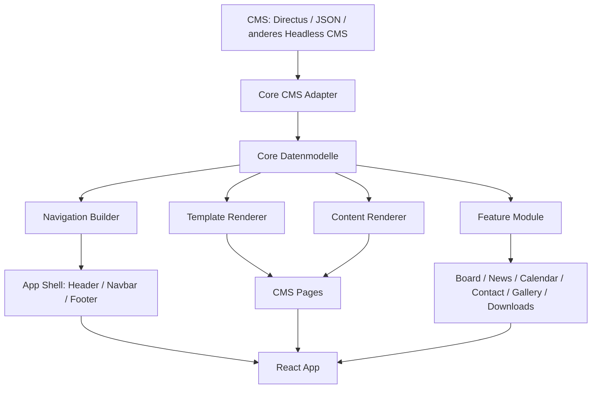
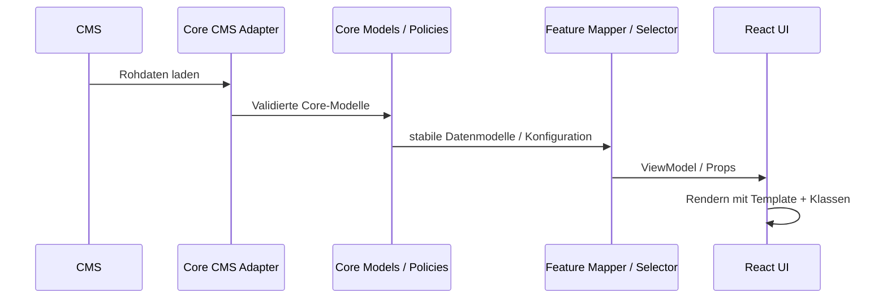

# ToDo.md – Zielarchitektur und Umsetzungsplan

## Ziel des Projekts

Es soll ein **feature-basiertes Frontend mit Vite + React + TypeScript + Tailwind v4.2** entstehen, das:

- **für Vereine und ähnliche Zwecke einfach anpassbar** ist,
- **möglichst viele Inhalte über ein CMS steuerbar** macht,
- **verschiedene CMS-Systeme schnell austauschbar** hält,
- **hohe Kohäsion, starke Kapselung und niedrige Kopplung** sicherstellt,
- **Features modular ein- und ausblendbar** macht,
- **Navigation, Seitenreihenfolge, Unterpunkte, Slugs und Templates** zentral über das CMS steuern kann,
- **rechtliche Seiten systemisch absichert** (Impressum, Datenschutz immer im Footer),
- langfristig als **erweiterbarer Website-Baukasten** dienen kann.

---

# 1. Architektur-Ziele

## Fachliche Ziele

- Inhalte wie **Texte, Bilder, Seitenstruktur und Navigation** über das CMS pflegen.
- Features wie **Vorstand, News, Kalender, Kontakt, Downloads, Galerie** modular ergänzen.
- Das System für verschiedene Vereine / Einsatzzwecke wiederverwenden.
- Nicht-Programmierer sollen möglichst viel im CMS steuern können.

## Technische Ziele

- **Feature-basierte Ordnerstruktur**.
- **Core** enthält nur generische Mechanik, keine fachspezifische Business-Logik.
- **Features** kapseln fachliche Logik.
- **CMS-Abstraktion über Adapter**, damit Directus, JSON oder andere CMS schnell austauschbar bleiben.
- **Klare Public APIs** pro Feature.
- **Keine Deep Imports zwischen Features**.
- **Tailwind v4.2** mit klarem Styling-Standard.
- **Validierung und Fallbacks**, damit CMS-gesteuerte Inhalte nicht leicht den Live-Betrieb beschädigen.

---

# 2. Leitprinzipien

## Architekturregeln

- **Core kennt keine CMS-Details** außer innerhalb der Adapter-Schicht.
- **Features kennen keine CMS-Rohdaten**.
- **Rohdaten aus einem CMS werden zuerst in stabile Core-Modelle gemappt**.
- **Feature-Mapper arbeiten nur mit Core-Daten oder bereits stabilen Eingaben**.
- **Templates gehören in den Core**.
- **Vorstand, News, Kalender usw. sind Features**.
- **Legal Pages sind Systemseiten** und erscheinen immer im Footer.
- **Navigation ist ein eigener, validierter Datentyp**, keine freie HTML-Struktur.
- **SEO wird vorerst bewusst nicht umgesetzt**, um Komplexität zu sparen.

## Qualitätsziele

- Hohe Kohäsion innerhalb eines Moduls.
- Niedrige Kopplung zwischen Modulen.
- Kapselung über `index.ts` pro Feature.
- Testbare Mapper, Selectors und Defaults.
- Stabilität durch Schemas, Defaults und Whitelists.

---

# 3. Zielbild – Systemübersicht



---

# 4. Architekturbaum

```text
src/
├─ app/                         # Einstieg, Provider, App-Zusammenbau
│  ├─ App.tsx
│  ├─ main.tsx
│  ├─ providers/
│  │  ├─ CmsProvider.tsx
│  │  ├─ SiteProvider.tsx
│  │  └─ QueryProvider.tsx
│  └─ router/
│     ├─ router.tsx
│     └─ buildRoutes.ts
│
├─ core/                        # Generische Mechanik des Systems
│  ├─ cms/
│  │  ├─ adapter/
│  │  │  ├─ CmsAdapter.ts
│  │  │  ├─ DirectusAdapter.ts
│  │  │  ├─ JsonAdapter.ts
│  │  │  └─ MockAdapter.ts
│  │  ├─ api/
│  │  │  ├─ siteApi.ts
│  │  │  ├─ pageApi.ts
│  │  │  ├─ navigationApi.ts
│  │  │  └─ mediaApi.ts
│  │  ├─ mappers/
│  │  │  ├─ siteMapper.ts
│  │  │  ├─ pageMapper.ts
│  │  │  ├─ navigationMapper.ts
│  │  │  └─ mediaMapper.ts
│  │  ├─ schemas/
│  │  │  ├─ site.schema.ts
│  │  │  ├─ page.schema.ts
│  │  │  └─ navigation.schema.ts
│  │  └─ types/
│  │     ├─ cms.types.ts
│  │     ├─ site.types.ts
│  │     ├─ page.types.ts
│  │     └─ navigation.types.ts
│  │
│  ├─ shell/
│  │  ├─ layout/
│  │  │  ├─ MainLayout.tsx
│  │  │  ├─ Header.tsx
│  │  │  ├─ Navbar.tsx
│  │  │  └─ Footer.tsx
│  │  ├─ navigation/
│  │  │  ├─ buildNavTree.ts
│  │  │  ├─ navGuards.ts
│  │  │  └─ nav.types.ts
│  │  └─ routing/
│  │     ├─ routeFactory.ts
│  │     ├─ staticRoutes.ts
│  │     └─ dynamicRoutes.ts
│  │
│  ├─ pages/
│  │  ├─ CmsPage.tsx
│  │  ├─ LegalPage.tsx
│  │  └─ NotFoundPage.tsx
│  │
│  ├─ templates/
│  │  ├─ registry/
│  │  │  ├─ templateRegistry.ts
│  │  │  └─ template.types.ts
│  │  ├─ components/
│  │  │  ├─ DefaultTemplate.tsx
│  │  │  ├─ LandingTemplate.tsx
│  │  │  ├─ SidebarTemplate.tsx
│  │  │  └─ NarrowContentTemplate.tsx
│  │  └─ TemplateRenderer.tsx
│  │
│  ├─ content/
│  │  ├─ renderer/
│  │  │  ├─ ContentRenderer.tsx
│  │  │  ├─ blockRegistry.ts
│  │  │  └─ block.types.ts
│  │  └─ blocks/
│  │     ├─ RichTextBlock.tsx
│  │     ├─ ImageBlock.tsx
│  │     ├─ HeroBlock.tsx
│  │     ├─ GalleryBlock.tsx
│  │     └─ ButtonGroupBlock.tsx
│  │
│  ├─ config/
│  │  ├─ env.ts
│  │  ├─ sitePolicy.ts
│  │  ├─ systemFlags.ts
│  │  └─ defaults.ts
│  │
│  └─ types/
│     ├─ common.types.ts
│     ├─ template.types.ts
│     └─ site.types.ts
│
├─ features/                    # Fachliche Module
│  ├─ pages/
│  ├─ board/
│  ├─ news/
│  ├─ calendar/
│  ├─ contact/
│  ├─ gallery/
│  ├─ downloads/
│  └─ ...
│
├─ shared/                      # Wiederverwendbare, neutrale Bausteine
│  ├─ ui/
│  ├─ lib/
│  ├─ validation/
│  └─ assets/
│
└─ styles/
   ├─ globals.css
   └─ theme.css
```

---

# 5. Core – Was genau umgesetzt werden soll

## 5.1 Core-CMS-Schicht

### Ziel
Einheitlicher Zugriff auf beliebige CMS-Systeme, ohne dass Features oder UI-Komponenten CMS-spezifische Details kennen.

### Umzusetzen

- `CmsAdapter` Interface definieren.
- Adapter für verschiedene Systeme vorbereiten:
  - `DirectusAdapter`
  - `JsonAdapter`
  - `MockAdapter`
- CMS-spezifische Rohdaten in stabile Core-Modelle mappen.
- Eingaben validieren (Schemas / Guards).
- Fallbacks bei fehlenden Daten definieren.

### Aufgaben

- [ ] `CmsAdapter` Interface definieren
- [ ] `getSiteSettings()` implementierbar machen
- [ ] `getNavigation()` implementierbar machen
- [ ] `getPages()` implementierbar machen
- [ ] `getPageBySlug(slug)` implementierbar machen
- [ ] `getLegalPages()` implementierbar machen
- [ ] optional `getFeatureData(featureKey)` definieren
- [ ] Directus-spezifische API-Client-Schicht vorbereiten
- [ ] JSON-basierte Mock-/Static-Variante vorbereiten
- [ ] Rohdaten-Mapping in `core/cms/mappers` umsetzen
- [ ] Schemas/Validation in `core/cms/schemas` umsetzen

### Ergebnis
Core und Features arbeiten nur noch mit stabilen Typen wie:

- `SiteSettings`
- `Page`
- `NavigationItem`
- `LegalPages`
- `MediaAsset`

---

## 5.2 Shell / Layout

### Ziel
Ein zentrales App-Grundgerüst für Header, Navbar, Footer und Seiteninhalt.

### Umzusetzen

- `MainLayout.tsx`
- `Header.tsx`
- `Navbar.tsx`
- `Footer.tsx`
- Ein sauberer Inhaltsbereich für Templates/Pages

### Regeln

- Header / Navbar / Footer sind generisch.
- Legal Pages erscheinen **immer** im Footer.
- Copyright- / Vereinsbereich ist immer im Footer.
- Die Footer-Position der Legal Pages ist **nicht frei konfigurierbar**.

### Aufgaben

- [ ] `MainLayout` bauen
- [ ] Footer-Layout definieren
- [ ] Footer-Legal-Bereich fest integrieren
- [ ] Navbar mit Dropdown-Unterstützung vorbereiten
- [ ] Logo / Vereinsname in der Shell anzeigen

---

## 5.3 Navigation-System

### Ziel
Die Reihenfolge der Seiten, Dropdown-Unterpunkte, Sichtbarkeit und Slugs sollen über das CMS gesteuert werden – aber innerhalb einer robusten Struktur.

### Umzusetzen

- Navigationsdatenmodell
- Tree Builder für Unterpunkte
- Sortierung nach `order`
- Validierung von Slugs und sichtbaren Einträgen

### Regeln

- Navigation ist ein **eigener Datentyp**.
- Kein freies HTML aus dem CMS.
- Unterpunkte werden über Parent-/Child-Beziehungen modelliert.
- Legale Systemseiten werden **nicht** über freie Navigation verwaltet.

### Aufgaben

- [ ] `NavigationItem` Typ definieren
- [ ] `buildNavTree.ts` implementieren
- [ ] Dropdown-Navigation in UI umsetzen
- [ ] Sortierung / Sichtbarkeit / Parent-Child validieren
- [ ] externer Link / Page-Link / Feature-Link unterscheiden

### Beispiel-Datenmodell

```ts
NavigationItem = {
  id: string;
  label: string;
  type: 'page' | 'feature' | 'external';
  target: string;
  order: number;
  visible: boolean;
  parentId?: string | null;
}
```

---

## 5.4 Routing-System

### Ziel
Statische und dynamische Routen kombinieren, ohne harte Kopplung an einzelne CMS-Systeme.

### Umzusetzen

- `staticRoutes.ts` für feste Systemseiten
- `dynamicRoutes.ts` für CMS-gesteuerte Seiten
- Feature-Routen modular ergänzen

### Regeln

- `Impressum` und `Datenschutz` sind Systemrouten.
- Standardseiten können über Slugs dynamisch geladen werden.
- Feature-Routen dürfen separat registriert werden.
- Ungültige oder fehlende Slugs führen auf 404.

### Aufgaben

- [ ] Router-Basis mit React Router aufsetzen
- [ ] `buildRoutes.ts` definieren
- [ ] statische Legal-Routen fest integrieren
- [ ] dynamische CMS-Seitenroute ergänzen
- [ ] Feature-Routen modular registrierbar machen
- [ ] 404-Seite umsetzen

---

## 5.5 Template-System

### Ziel
Templates gehören zum Core und definieren das Layout / Design einer Seite. Im CMS kann nur ausgewählt werden, **welches** Template eine Seite nutzt.

### Umzusetzen

- `templateRegistry.ts`
- `TemplateRenderer.tsx`
- Grundtemplates:
  - `default`
  - `landing`
  - `sidebar`
  - `narrow-content`

### Regeln

- Templates werden **im Code definiert**.
- Das CMS darf nur erlaubte Templates auswählen.
- Templates sind Whitelist-basiert.
- Templates sind generisch, keine Business-Logik.

### Aufgaben

- [ ] `TemplateDefinition` Typ definieren
- [ ] Template-Registry anlegen
- [ ] `TemplateRenderer` bauen
- [ ] Default-Template als Fallback einbauen
- [ ] 3–4 Basistemplates umsetzen

---

## 5.6 Content-Rendering / Block-System

### Ziel
Seiteninhalte (Text, Bild, Hero, Galerie, Buttons …) sollen im CMS blockbasiert steuerbar sein, statt als freies HTML.

### Umzusetzen

- `ContentRenderer.tsx`
- `blockRegistry.ts`
- Blocktypen definieren und rendern

### Minimale Blocktypen

- RichText
- Image
- Hero
- Gallery
- ButtonGroup
- optional später: FAQ, DownloadList, NewsTeaser, CalendarEmbed

### Regeln

- Nur registrierte Blocktypen rendern.
- Unbekannte Blocktypen werden abgefangen.
- Rohdaten werden validiert.

### Aufgaben

- [ ] `ContentBlock` Typ definieren
- [ ] Block-Registry umsetzen
- [ ] `RichTextBlock` bauen
- [ ] `ImageBlock` bauen
- [ ] `HeroBlock` bauen
- [ ] `GalleryBlock` bauen
- [ ] `ButtonGroupBlock` bauen
- [ ] Fallback für unbekannte Blöcke definieren

---

## 5.7 System-Konfiguration / Policies

### Ziel
Bewusst festlegen, was frei konfigurierbar ist und was systemisch geschützt bleibt.

### Regeln

#### Über CMS steuerbar
- Inhalte
- Bilder
- Seiten
- Slugs
- Reihenfolge
- Navigation
- Dropdown-Unterpunkte
- Template-Auswahl
- Sichtbarkeit von Inhalten / Navigationseinträgen
- Footer-Zusatzinformationen
- Vereinsname / Logo

#### Im Code geschützt
- erlaubte Templates
- erlaubte Blocktypen
- Footer-Zwang für Legal Pages
- Core-Routing
- Validierung
- Adapter-System
- Sicherheits-Fallbacks

### Aufgaben

- [ ] `sitePolicy.ts` formulieren
- [ ] erlaubte Freiheitsgrade dokumentieren
- [ ] verbotene / geschützte Bereiche dokumentieren
- [ ] Fallback-Strategien definieren

---

# 6. Features – Was genau umgesetzt werden soll

## 6.1 Grundregeln für jedes Feature-Package

Jedes Feature liegt unter `src/features/<feature>/`.

### Standardstruktur

```text
src/features/<feature>/
├── index.ts
├── components/
│   ├── <Feature>Root.tsx
│   ├── ...
├── model/
│   ├── <feature>.types.ts
│   ├── <feature>.mapper.ts
│   ├── <feature>.selectors.ts
│   ├── <feature>.defaults.ts
│   └── <feature>.schema.ts
├── styles/
│   ├── <feature>.classes.ts
│   └── <feature>.theme.css
├── api/                # optional
├── routes/             # optional
├── lib/                # optional
└── tests/              # optional, aber empfohlen
```

### Regeln

- Externe Konsumenten importieren **nur über `index.ts`**.
- Keine Deep Imports in interne Dateien fremder Features.
- Komponenten fetchen nicht selbst.
- Mapper sind pure Functions.
- Selectors enthalten abgeleitete Logik.
- Feature-Modelle dürfen keine CMS-Rohdaten kennen.
- Styling läuft über `classes.ts` und ggf. `theme.css`.
- `tokens.ts` ist **nicht Pflicht**, da Tailwind v4.2 CSS-first arbeitet.

### Aufgaben (für alle Features)

- [ ] `index.ts` als Public API definieren
- [ ] Root-Komponente + Sub-Komponenten anlegen
- [ ] Typen und Mapper definieren
- [ ] Defaults und Selectors anlegen
- [ ] styles über `classes.ts` kapseln
- [ ] Tests für Mapper/Selectors vorbereiten

---

## 6.2 Feature `pages`

### Rolle
Dynamische Standardseiten aus dem CMS laden und über Core-Templates rendern.

### Aufgaben

- [ ] `pages` Feature anlegen
- [ ] Page-spezifische ViewModels definieren
- [ ] CMS-Seite anhand Slug laden
- [ ] Template-Auswahl an Core übergeben
- [ ] Content-Blocks an Core-Renderer übergeben

---

## 6.3 Feature `board`

### Rolle
Vorstandsseite / Gremienseite über Personen + Rollen + Zuordnungen darstellen.

### Fachliche Verantwortung

- Personen laden
- Rollen laden
- Zuordnungen auflösen
- Sortierung und Gruppierung definieren
- Darstellung als Liste/Grid

### Aufgaben

- [ ] `board` Feature anlegen
- [ ] Typen für Person, Role, Assignment definieren
- [ ] Mapper für Board-ViewModel definieren
- [ ] Sortierung / Gruppierung in Selectors auslagern
- [ ] `BoardRoot`, `BoardGrid`, `BoardMemberCard` bauen
- [ ] optionale eigene Route vorbereiten

---

## 6.4 Feature `news`

### Rolle
News-Übersicht und News-Detailseiten bereitstellen, falls eine passende CMS-Collection vorhanden ist.

### Aufgaben

- [ ] `news` Feature anlegen
- [ ] Typen für News-Item definieren
- [ ] News-Overview-Komponente bauen
- [ ] News-Detail-Komponente bauen
- [ ] eigene Route(n) definieren
- [ ] optional News-Teaser-Block für Startseite ergänzen

---

## 6.5 Feature `calendar`

### Rolle
Optional Kalender-Integration darstellen (z. B. Google Kalender Embed oder Terminliste).

### Aufgaben

- [ ] `calendar` Feature anlegen
- [ ] Kalenderdarstellung kapseln
- [ ] optional Embed-Variante unterstützen
- [ ] CMS-gesteuerte Aktivierung / Sichtbarkeit berücksichtigen

---

## 6.6 Feature `contact`

### Rolle
Kontaktinformationen / Ansprechpartner / Kontaktseite darstellen.

### Aufgaben

- [ ] `contact` Feature anlegen
- [ ] Kontaktmodell definieren
- [ ] Kontakt-Komponenten bauen
- [ ] optional Kontakt-Block für allgemeine Seiten ergänzen

---

## 6.7 Optionale spätere Features

- [ ] `gallery`
- [ ] `downloads`
- [ ] `sponsors`
- [ ] `faq`
- [ ] `history`
- [ ] `events`

---

# 7. Shared – Was umgesetzt werden soll

## Rolle
Neutrale, wiederverwendbare Bausteine, die nicht zu einem einzelnen Feature gehören.

### Umzusetzen

- `shared/ui`
  - Button
  - Card
  - Section
  - Loader
- `shared/lib`
  - slug helper
  - sort helper
  - invariant helper
- `shared/validation`
  - allgemeine zod/helpers
- `shared/assets`
  - Icons, neutrale Assets

### Aufgaben

- [ ] kleine UI-Bibliothek definieren
- [ ] gemeinsame Hilfsfunktionen bündeln
- [ ] gemeinsame Validierungshelfer ergänzen

---

# 8. Styling-Strategie mit Tailwind v4.2

## Ziel
Sauberes, kapselbares Styling mit möglichst wenig Streuung direkt in JSX.

## Regeln

- Tailwind v4.2 ist die Basis.
- Styling in Features über `styles/<feature>.classes.ts` kapseln.
- Feature-spezifische Variablen optional über `theme.css`.
- Globale Designwerte zentral in `src/styles/theme.css` halten.
- Keine unkontrollierte Inline-Styling-Wildnis.
- `tokens.ts` nur dann nutzen, wenn es sich um echte semantische Konstanten handelt – nicht für redundante globale Farb-/Spacing-Duplikate.

## Aufgaben

- [ ] globale Theme-Datei anlegen
- [ ] Klassenkonvention für Features festlegen
- [ ] Fokus auf semantische Klassengruppen
- [ ] responsive Varianten in Klassen kapseln

### Beispielstruktur

```text
styles/
├─ globals.css
└─ theme.css
```

---

# 9. CMS – Was modelliert werden soll

## Ziel
Das CMS soll Inhalte und Konfiguration steuern, ohne das System vollständig unkontrolliert zu machen.

## Collections / Inhalte

### 9.1 `site_settings`
Globale Seiteneinstellungen

**Enthält z. B.:**
- Vereinsname
- Logo
- Footer-Zusatztext
- Default-Template
- optional Theme-Variante
- Homepage-Slug

### Aufgaben
- [ ] `site_settings` Datenmodell definieren
- [ ] Mapping nach `SiteSettings` definieren

---

### 9.2 `pages`
Standard-CMS-Seiten

**Enthält z. B.:**
- Titel
- Slug
- Template-Key
- Sichtbarkeit
- Content-Blocks
- Status / Publish-Zustand

### Aufgaben
- [ ] `pages` Datenmodell definieren
- [ ] Block-Feld für Inhalte vorsehen
- [ ] Slug-Regeln festlegen

---

### 9.3 `navigation_items`
Navigation und Dropdowns

**Enthält z. B.:**
- Label
- Typ (`page`, `feature`, `external`)
- Ziel
- Reihenfolge
- Sichtbarkeit
- Parent-Referenz

### Aufgaben
- [ ] `navigation_items` Collection definieren
- [ ] Parent-/Child-Modell für Dropdowns vorsehen
- [ ] Sortierung festlegen

---

### 9.4 `legal_pages`
Impressum und Datenschutz

**Enthält z. B.:**
- Typ (`impressum`, `datenschutz`)
- Inhaltsblöcke
- Sichtbarkeit (nur in Grenzen)

### Regeln
- Legal Pages sind Systemseiten.
- Sie erscheinen immer im Footer.
- Sie werden nicht frei in der Navbar platziert.

### Aufgaben
- [ ] `legal_pages` Collection definieren
- [ ] Systemische Footer-Einbindung sicherstellen

---

### 9.5 `persons`
Personenstammdaten

**Enthält z. B.:**
- Name
- Bild
- E-Mail
- Telefon

### Aufgaben
- [ ] `persons` Collection definieren

---

### 9.6 `roles`
Rollen / Ämter

**Enthält z. B.:**
- Titel
- Reihenfolge
- optional Bereich / Kategorie

### Aufgaben
- [ ] `roles` Collection definieren

---

### 9.7 `board_assignments`
Verknüpfung Person ↔ Rolle

**Enthält z. B.:**
- Person-Referenz
- Rollen-Referenz
- Reihenfolge
- Sichtbarkeit

### Aufgaben
- [ ] `board_assignments` Collection definieren
- [ ] Mapping fürs Board-Feature umsetzen

---

### 9.8 Optionale spätere Collections

- [ ] `news`
- [ ] `events`
- [ ] `downloads`
- [ ] `gallery`
- [ ] `sponsors`

---

# 10. Datenfluss



---

# 11. Abhängigkeitsregeln

## Erlaubt

- Feature → `shared/*`
- Feature → stabile APIs aus `core/*`
- Feature → eigene interne Dateien (relativ)
- App → Feature Public APIs

## Verboten

- Feature A → interne Dateien von Feature B
- Feature → CMS-Rohdatentypen
- Externe Nutzung → Deep Imports in ein Feature
- Business-Logik direkt in Templates oder Core-Shell

## Aufgaben

- [ ] Abhängigkeitsregeln dokumentieren
- [ ] Im Projekt-README festhalten
- [ ] optional per Lint-Regeln absichern

---

# 12. Sicherheits- und Stabilitätsmaßnahmen

## Ziel
Viel CMS-Steuerung ermöglichen, ohne dass Fehler sofort das Live-System instabil machen.

### Maßnahmen

- Schemas / Validierung für CMS-Daten
- Whitelist für Templates
- Whitelist für Content-Blöcke
- Fallback-Template
- Fallback bei ungültigen Slugs
- Fallbacks für leere oder fehlende Inhalte
- Unknown-Block-Handling
- Robuste Defaults pro Feature

### Aufgaben

- [ ] Schema-Validierung definieren
- [ ] Fallback-Strategie dokumentieren
- [ ] Unknown-Block-Komponente vorsehen
- [ ] Defaults in Features ergänzen

---

# 13. Priorisierte Umsetzungsreihenfolge

## Phase 1 – Fundament

- [ ] Vite + React + TypeScript + Tailwind v4.2 Grundsetup
- [ ] `src/` Zielstruktur anlegen
- [ ] Routing-Basis aufsetzen
- [ ] `shared/` Grundbausteine anlegen
- [ ] `styles/globals.css` + `styles/theme.css` anlegen

## Phase 2 – Core

- [ ] CMS-Adapter-Interface definieren
- [ ] JSON-/Mock-Adapter bauen
- [ ] Directus-Adapter vorbereiten
- [ ] Core-Modelle und Schemas definieren
- [ ] Shell (Header/Navbar/Footer) bauen
- [ ] Navigation-System bauen
- [ ] Template-System bauen
- [ ] Content-Block-System bauen
- [ ] Legal Pages systemisch anbinden

## Phase 3 – Erste Features

- [ ] `pages` Feature bauen
- [ ] `board` Feature bauen
- [ ] `contact` Feature bauen
- [ ] `calendar` Feature optional bauen

## Phase 4 – CMS-Datenmodell

- [ ] `site_settings`
- [ ] `pages`
- [ ] `navigation_items`
- [ ] `legal_pages`
- [ ] `persons`
- [ ] `roles`
- [ ] `board_assignments`

## Phase 5 – Erweiterungen

- [ ] `news`
- [ ] `gallery`
- [ ] `downloads`
- [ ] `sponsors`
- [ ] `faq`

## Phase 6 – Härtung

- [ ] Tests für Mapper und Selectors
- [ ] Fallback-Strategien prüfen
- [ ] Import-/Abhängigkeitsregeln absichern
- [ ] Dokumentation finalisieren

---

# 14. Definition of Done

Ein erster sinnvoller Meilenstein ist erreicht, wenn:

- [ ] CMS über Adapter abstrahiert ist
- [ ] Standardseiten aus dem CMS geladen werden können
- [ ] Slugs, Seitenreihenfolge und Dropdown-Navigation aus dem CMS funktionieren
- [ ] Templates im Core auswählbar sind
- [ ] Inhaltsblöcke aus dem CMS gerendert werden
- [ ] Legal Pages immer im Footer erscheinen
- [ ] mindestens das `board` Feature sauber als Paket umgesetzt ist
- [ ] Feature-Pakete klare Public APIs haben
- [ ] keine Features CMS-Rohdaten direkt kennen
- [ ] Styling-Konvention mit Tailwind v4.2 steht

---

# 15. Kurzfassung in einem Satz

Es soll ein **klar gekapseltes, feature-basiertes React/TypeScript-System mit starkem Core, austauschbarer CMS-Adapter-Schicht, CMS-gesteuerter Navigation/Seitenstruktur, Core-Templates, blockbasierten Inhalten und modularen Features wie Vorstand/News/Kalender** entstehen – mit robusten Grenzen, damit viel Steuerbarkeit möglich ist, ohne dass der Live-Betrieb unnötig fragil wird.
